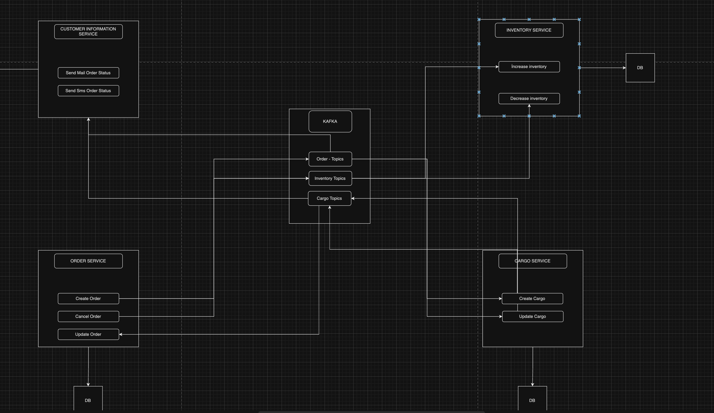

# Order Management System With Kafka
___
>This project is a microservice architecture for tracking order processes that I developed to experiment with Kafka in an extended way. It includes basic operations such as order creation, order status update, inventory management and customer service.

## Used Technologies
<ul>
  <li>Spring Boot</li>
  <li>Apache Kafka</li>
  <li>PostgreSQL</li>
  <li>Docker</li>
</ul>

## Kafka Flow Chart
